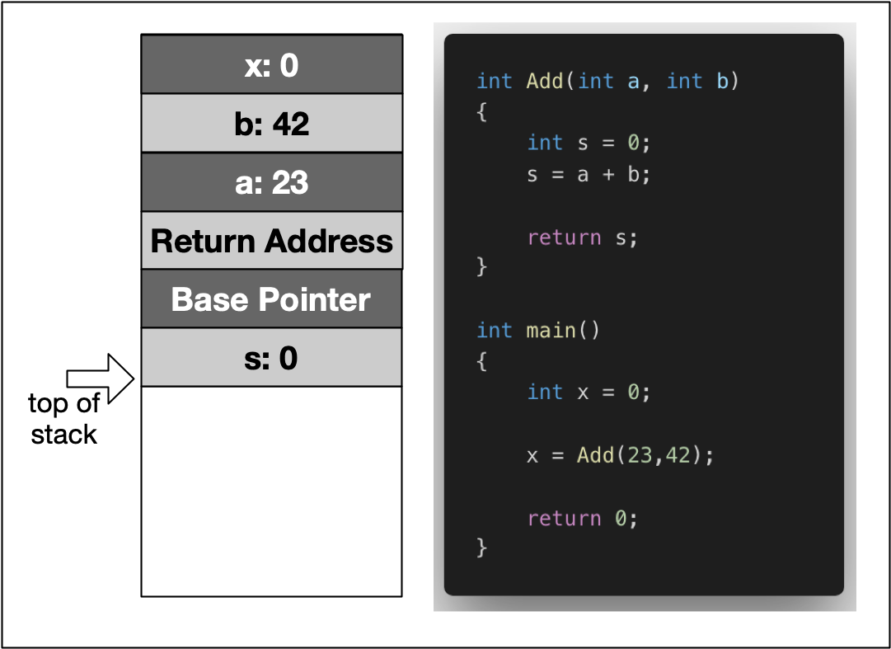

# Stack Memory

### The Process Memory Model

As we have seen in the previous lesson, each program is assigned its own virtual memory by the operating system. This address space is arranged in a linear fashion with one block of data being stored at each address. It is also divided into several distinct areas as illustrated by the figure below:

1. The **stack** is a contiguous memory block with a fixed maximum size. If a program exceeds this size, it will crash. The stack is used for storing automatically allocated variables such as local variables or function parameters. If there are multiple threads in a program, then each thread has its own stack memory. New memory on the stack is allocated when the path of execution enters a scope and freed again once the scope is left. It is important to know that the stack is managed "automatically" by the compiler, which means we do not have to concern ourselves with allocation and deallocation.
2. The **heap** (also called "free store" in C++) is where data with dynamic storage lives. It is shared among multiple threads in a program, which means that memory management for the heap needs to take concurrency into account. This makes memory allocations in the heap more complicated than stack allocations. In general, managing memory on the heap is more (computationally) expensive for the operating system, which makes it slower than stack memory. Contrary to the stack, the heap is not managed automatically by the system, but by the programmer. If memory is allocated on the heap, it is the programmer’s responsibility to free it again when it is no longer needed. If the programmer manages the heap poorly or not at all, there will be trouble.
3. The **BSS** (Block Started by Symbol) segment is used in many compilers and linkers for a segment that contains global and static variables that are initialized with zero values. This memory area is suitable, for example, for arrays that are not initialized with predefined values.
4. The **Data** segment serves the same purpose as the BSS segment with the major difference being that variables in the Data segment have been initialized with a value other than zero. Memory for variables in the Data segment (and in BSS) is allocated once when a program is run and persists throughout its lifetime.

### Memory Allocation in C++

1. **Static memory allocation** is performed for static and global variables, which are stored in the BSS and Data segment. Memory for these types of variables is allocated once when your program is run and persists throughout the life of your program.
2. **Automatic memory allocation** is performed for function parameters as well as local variables, which are stored on the stack. Memory for these types of variables is allocated when the path of execution enters a scope and freed again once the scope is left.
3. **Dynamic memory allocation** is a possibility for programs to request memory from the operating system at runtime when needed. This is the major difference to automatic and static allocation, where the size of the variable must be known at compile time. Dynamic memory allocation is not performed on the limited stack but on the heap and is thus (almost) only limited by the size of the address space.

### Properties of Stack Memory

The stack is the place in virtual memory where the local variables reside, including arguments to functions. Each time a function is called, the stack grows (from top to bottom) and each time a function returns, the stack contracts. When using multiple threads (as in concurrent programming), it is important to know that each thread has its own stack memory - which can be considered thread-safe.

In the following, a short list of key properties of the stack is listed:

1. The stack is a **contiguous block of memory**. It will not become fragmented (as opposed to the heap) and it has a fixed maximum size.
2. When the **maximum size of the stack** memory is exceeded, a program will crash.
3. Allocating and deallocating **memory is fast** on the stack. It only involves moving the stack pointer to a new position.

**Stack memory during a function call:**

### Call-By-Value vs. Call-By-Reference

Two major downsides to `Call-By-Value`:

1. Passing parameters by value means that a copy is created, which is an expensive operation that might consume large amounts of memory, depending on the data that is being transferred. Later in this course we will encounter "move semantics", which is an effective way to compensate for this downside.
2. Passing by value also means that the created copy can not be used as a back channel for communicating with the caller, for example by directly writing the desired information into the variable.

### Call-By-Reference or Call-By-Pointer

The following selection of properties contrasts the two methods so it will be easier to decide which to use from the perspective of the use-case at hand:

- Pointers can be declared without initialization. This means we can pass an uninitialized pointer to a function who then internally performs the initialization for us.
- Pointers can be reassigned to another memory block on the heap.
- References are usually easier to use (depending on the expertise level of the programmer). Sometimes however, if a third-party function is used without properly looking

